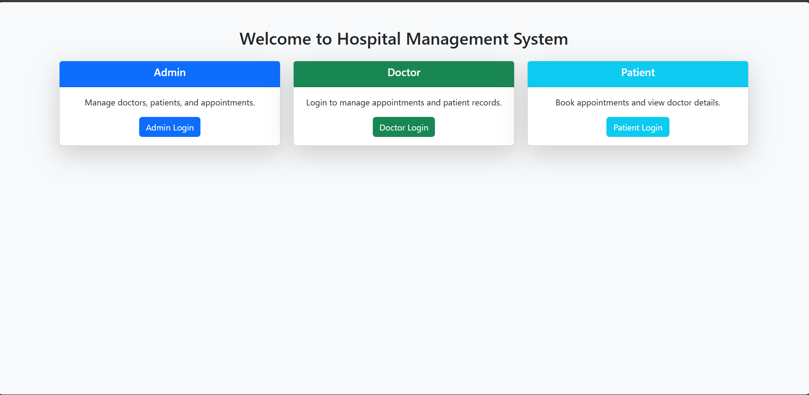
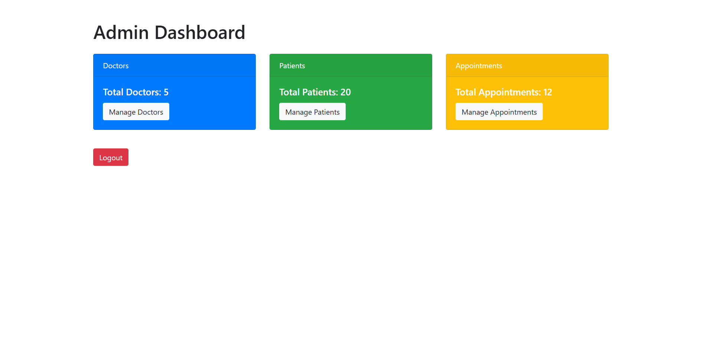
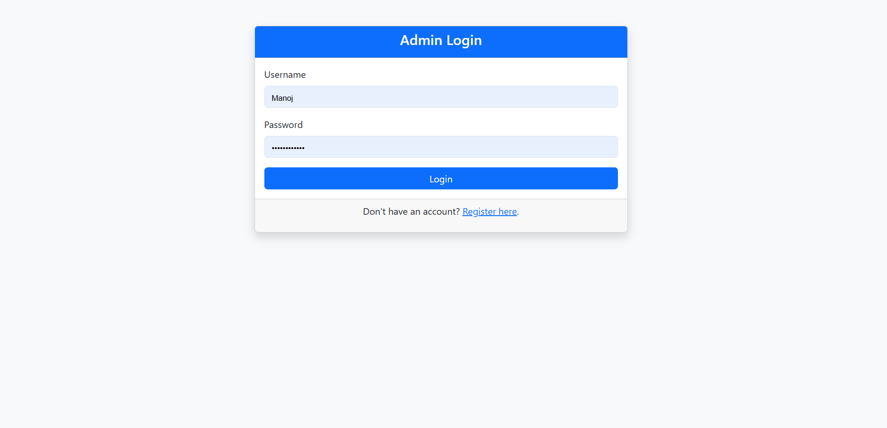
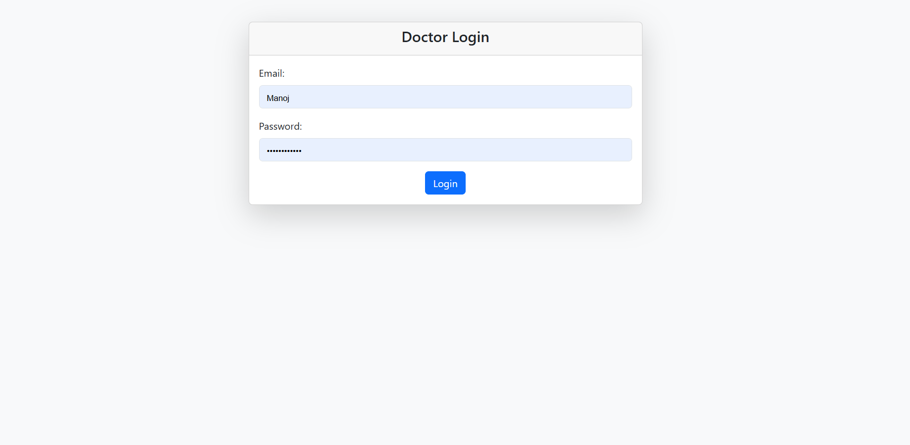
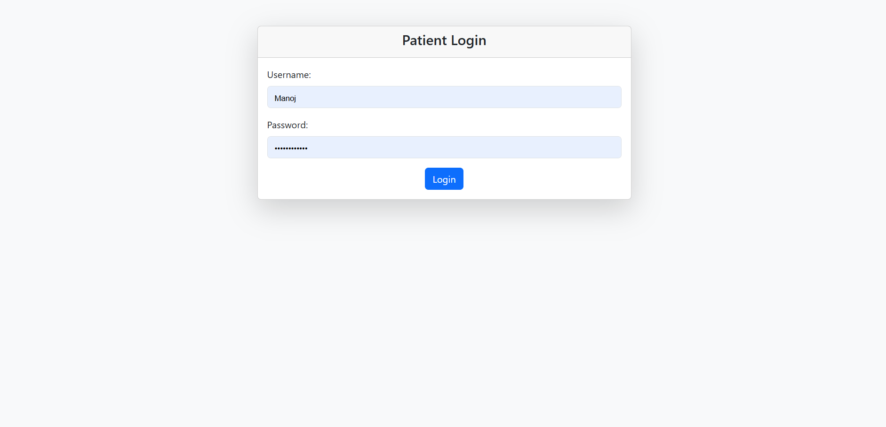

# 🏥 Hospital Management System

A **Java-based web application** developed using **JSP, Servlet, MySQL**, and **IntelliJ IDEA**. It follows the **MVC architecture** and uses **Maven** for project management. This Hospital Management System (HMS) is designed to streamline and digitize hospital activities such as managing doctors, patients, and appointments.

---

## 🎯 Objective

The main objective of this project is to **manage hospital operations online**, allowing admins, doctors, and receptionists to perform their respective tasks efficiently in a centralized system.

---

## 👥 System Users

There are three main types of users (actors) in this application:

1. **Admin**
2. **Doctor**
3. **Receptionist**

---

## 📦 Modules

### 👨‍💼 Admin

Admin is the super user with full privileges. Tasks include:

- ADD / UPDATE / DELETE **Doctors**, **Receptionists**, and **Patients**
- VIEW all records
- Manage appointments

### 👨‍⚕️ Doctor

Doctors have access to:

- VIEW list of appointments
- VIEW patient list

### 💁 Receptionist

Receptionists can:

- ADD / EDIT / VIEW appointments
- ADD / EDIT / VIEW patient information

---

## 🛠️ Technology Stack Used

### 💻 Front-End

- JSP (JavaServer Pages)
- HTML5
- CSS3
- JavaScript

### 🌐 Server-Side

- Java Servlets (Jakarta Servlet API)

### 🗄️ Back-End

- MySQL Database

### 🔌 Database Connectivity

- JDBC (Java Database Connectivity)

### 🎨 Styling Framework

- Bootstrap 5

### 🚀 Server

- Apache Tomcat 11

### 🧱 Architecture

- MVC (Model-View-Controller)

---

## 🖼️ Application Screenshots

### 🔷 Welcome Page

This is the welcome page of the Hospital Management System where users can choose their role to log in.

> A clean and user-friendly welcome interface guiding users to their respective dashboards.

---

### 🧭 Admin Dashboard

Once logged in, the Admin can access all functionalities like managing doctors, receptionists, patients, and appointments.

> The Admin dashboard with all management options available on the sidebar.

---

### 🔐 Login Screens

Each type of user (Patient, Doctor, Admin) has a dedicated login interface.

**Patient Login**

> Patients use this screen to log in and manage appointments and personal records.

---

**Doctor Login**

> Doctors log in here to view their scheduled appointments and assigned patients.

---

**Admin Login**

> Admins use this login page to access the entire management system.
